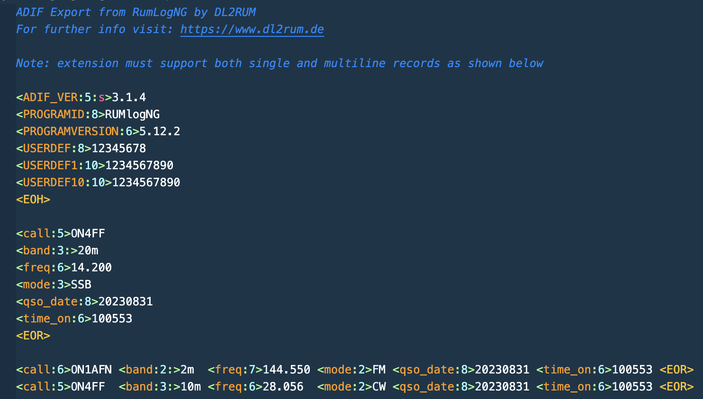

# ADIF syntax highlighting

## Features

This extension enables syntax highlighting of the ADIF file format.  The standard file extensions are ADI And ADIF.

>Note that ADX files also contain ADIF data but in a more modern XML format.
>The ADX file format is not supported.

## What is the ADIF file format

Ever since software has become a part of amateur radio, there have been as many data formats as there have been ham radio software programmers.  Hams have struggled with converting data among various formats.  In early 1996 KK7A promoted the idea of a standard for exchange of ham data, and an Internet reflector was set up for discussing such a standard.  Ray WF1B and Dennis WN4AZY, publishers of commercial ham radio software, took the best suggestions from this discussion and proposed the Amateur Data Interface Format (ADIF), which Ray introduced as ADIF 1.0 at the 1996 Dayton Hamvention.  Within a year, this standard was adopted by most software publishers.

Currently the ADIF format is widely adopted as the standard data format to import and export Radio Amateur logbooks between various software applications.

The ADIF file format is composed of a case-independent field name F, a data length L, and an optional data type indicator T separated by colons and enclosed in angle brackets, followed by data D of length L:

```<F:L:T>D```

Each QSO (radio contact) is contained in a record which is followed by a case-insensitive End-Of-Record tag:

```<EOR>```

An optional header begins with any character other than < and terminates with a case-insensitive End-Of-Header tag:

```<EOH>```

Example:



## About the author

Filip Jonckers is a licensed radio amateur since 1993 with the HAM radio callsign ON4FF (and previously ON1AFN).

## What is Amateur Radio

Radio amateurs can be found almost in every country and in various circles.
They represent a motley collection of backgrounds and professions. They have one thing in common: their passion for technology and for radio. Among them were the late King Hussein of Jordan, his fellow King Juan Carlos of Spain and the late Indian Prime Minister Rhajiv Ghandi. Carlos Menem, president of Argentina, also joined radio amateurs. But there is room for you too.

You too can become a radio amateur! You will then join the circle of friends of more than a million licensed radio amateurs worldwide.

## Requirements

None.

## Extension Settings

None.

## Known Issues

None at this time.

## Release Notes

### 1.0.3

Correct link to GitHub repository.

### 1.0.1

Initial release of ADIF file syntax highlighting extension for Visual Studio Code.

## Support and bug reports

Please report any issues via the GitHub repository.  Also any contributions are much appreciated.

## For more information

* [ADIF file format specifications](https://www.adif.org/)
* [GitHub repository](https://github.com/filipjonckers/adif-syntax-highlighting-vscode)
